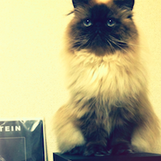
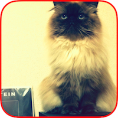

#YSImageFilter

UIImage filter. Allows resizing, masking, border, background color.

##Interface

```
typedef void(^YSImageFilterComletion)(UIImage *filteredImage);

// Sync
- (UIImage*)ys_filter:(YSImageFilter*)filter;

// Async
- (void)ys_filter:(YSImageFilter*)filter
   withCompletion:(YSImageFilterComletion)completion;
```

##Usage

```
YSImageFilter *filter = [[YSImageFilter alloc] init];
filter.size = CGSizeMake(200.f, 200.f);
filter.quality = kCGInterpolationHigh;
filter.trimToFit = YES;
filter.borderColor = [UIColor redColor];
filter.borderWidth = 5.f;
filter.mask = YSImageFilterMaskRoundedCorners;
filter.maskCornerRadius = 30.f;

UIImage *filteredImage = [image ys_filter:filter];
```
 → 

```
YSImageFilter *filter = [[YSImageFilter alloc] init];
filter.backgroundColor = color;

UIImage *filteredImage = [image ys_filter:filter];
```

	→	

##Installation

```
pod 'YSImageFilter', :git => 'https://github.com/yusuga/YSImageFilter.git'
```

#Example - TestUIImageFilters

CoreGraphics vs [NYXImagesKit](https://github.com/Nyx0uf/NYXImagesKit) vs [GPUImage](https://github.com/BradLarson/GPUImage) vs CoreImage

##Benchmark - Resize

###Solid color image


####100 trials

**[iPhone4 - iOS7.0]**

||1000x1000px -> 50x50px|1000x1000px -> 300x300px|
|:---|:---|:---|
|CoreGraphics(None)|0.002660 (375 FPS)|0.034310 (29 FPS)|
|CoreGraphics(Low)|0.002756 (362 FPS)|0.075693 (13 FPS)|
|CoreGraphics(Medium)|0.038360 (26 FPS)|0.126424 (7 FPS)|
|CoreGraphics(High)|0.060210 (16 FPS)|0.172681 (5 FPS)|
|NYXImagesKit|0.051545 (19 FPS)|0.109839 (9 FPS)|
|GPUImage|0.011259 (88 FPS)|0.012334 (81 FPS)|
|CoreImage(CPU)|0.011139 (89 FPS)|0.015267 (65 FPS)|
|CoreImage(GPU)|0.012046 (83 FPS)|0.015520 (64 FPS)|

**[iPhone5s - iOS7.1]**

||1000x1000px -> 50x50px|1000x1000px -> 300x300px|
|:---|:---|:---|
|CoreGraphics(None)|0.000261 (3825 FPS)|0.005128 (195 FPS)|
|CoreGraphics(Low)|0.000283 (3533 FPS)|0.007939 (125 FPS)|
|CoreGraphics(Medium)|0.003536 (282 FPS)|0.013599 (73 FPS)|
|CoreGraphics(High)|0.006976 (143 FPS)|0.019372 (51 FPS)|
|NYXImagesKit|0.005342 (187 FPS)|0.012160 (82 FPS)|
|GPUImage|0.004330 (230 FPS)|0.005025 (199 FPS)|
|CoreImage(CPU)|0.002575 (388 FPS)|0.003410 (293 FPS)|
|CoreImage(GPU)|0.002737 (365 FPS)|0.004470 (223 FPS)|

###Picture image


####100 trials

**[iPhone4 - iOS7.0]**

||1000x1000px -> 50x50px|1000x1000px -> 300x300px|
|:---|:---|:---|
|CoreGraphics(None)|0.003887 (257 FPS)|0.044526 (22 FPS)|
|CoreGraphics(Low)|0.004481 (223 FPS)|0.081731 (12 FPS)|
|CoreGraphics(Medium)|0.121744 (8 FPS)|0.271093 (3 FPS)|
|CoreGraphics(High)|0.206694 (4 FPS)|0.479763 (2 FPS)|
|NYXImagesKit|0.206455 (4 FPS)|0.477664 (2 FPS)|
|GPUImage|0.039227 (25 FPS)|0.040107 (24 FPS)|
|CoreImage(CPU)|0.037182 (26 FPS)|0.053168 (18 FPS)|
|CoreImage(GPU)|0.036454 (27 FPS)|0.054199 (18 FPS)|

**[iPhone5s - iOS7.1]**

||1000x1000px -> 50x50px|1000x1000px -> 300x300px|
|:---|:---|:---|
|CoreGraphics(None)|0.000361 (2768 FPS)|0.005303 (188 FPS)|
|CoreGraphics(Low)|0.000363 (2755 FPS)|0.008804 (113 FPS)|
|CoreGraphics(Medium)|0.009869 (101 FPS)|0.025250 (39 FPS)|
|CoreGraphics(High)|0.021267 (47 FPS)|0.049103 (20 FPS)|
|NYXImagesKit|0.021170 (47 FPS)|0.048766 (20 FPS)|
|GPUImage|0.010341 (96 FPS)|0.011156 (89 FPS)|
|CoreImage(CPU)|0.006236 (160 FPS)|0.012596 (79 FPS)|
|CoreImage(GPU)|0.008334 (119 FPS)|0.016483 (60 FPS)|

##Benchmark - Sepia


###100 trials

**[iPhone4 - iOS7.0]**

||50x50px|500x500px|
|:---|:---|:---|
|CoreImage(CPU)|0.007829 (127 FPS)|0.445357 (2 FPS)|
|CoreImage(GPU)|0.007868 (127 FPS)|0.446188 (2 FPS)|
|NYXImagesKit|0.007809 (128 FPS)|0.445349 (2 FPS)|
|GPUImage|0.003374 (296 FPS)|0.044464 (22 FPS)|

**[iPhone4s - iOS7.0]**

||50x50px|500x500px|
|:---|:---|:---|
|CoreImage(CPU)|0.004804 (208 FPS)|0.067474 (14 FPS)|
|CoreImage(GPU)|0.004831 (206 FPS)|0.067433 (14 FPS)|
|NYXImagesKit|0.004781 (209 FPS)|0.067502 (14 FPS)|
|GPUImage|0.003426 (291 FPS)|0.016321 (61 FPS)|

**[iPhone5 - iOS7.0]**

||50x50px|500x500px|
|:---|:---|:---|
|CoreImage(CPU)|0.003257 (307 FPS)|0.037465 (26 FPS)|
|CoreImage(GPU)|0.003276 (305 FPS)|0.037323 (26 FPS)|
|NYXImagesKit|0.003311 (302 FPS)|0.037361 (26 FPS)|
|GPUImage|0.002533 (394 FPS)|0.007925 (126 FPS)|

**[iPhone5s - iOS7.1]**

||50x50px|500x500px|
|:---|:---|:---|
|CoreImage(CPU)|0.001799 (555 FPS)|0.011808 (84 FPS)|
|CoreImage(GPU)|0.001816 (550 FPS)|0.009719 (102 FPS)|
|NYXImagesKit|0.001871 (534 FPS)|0.009674 (103 FPS)|
|GPUImage|0.001799 (555 FPS)|0.006431 (155 FPS)|